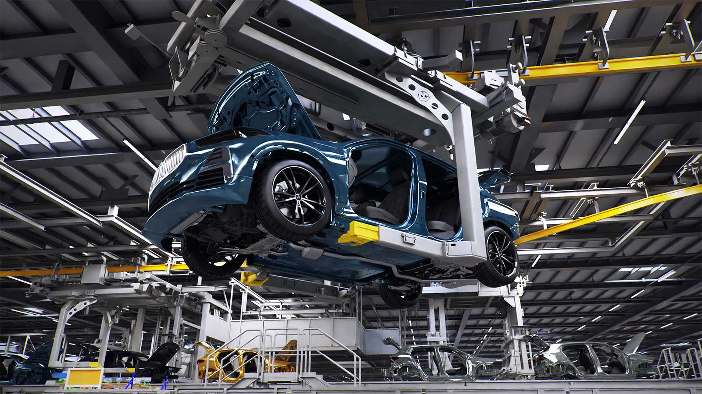

# 제조/산업 - AI 활용 디지털 프로덕트 및 사내 내재화 시장 조사

작성일: 2026-02-09

## Executive Summary

- 제조/산업 분야의 AI는 "공정 최적화(Process Optimization)"와 "다운타임 최소화(Predictive Maintenance)"에 집중되어 있으며, 최근 생성형 AI가 "산업용 코파일럿(Industrial Copilot)" 형태로 도입되면서 현장 작업자의 문제 해결 능력을 증강시키고 있다.
- 데이터 보안(OT Security)과 실시간성(Real-time) 요구로 인해 **Edge AI**와 **On-premise** 도입 비중이 매우 높다.
- 디지털 트윈(Digital Twin)과 결합된 AI 시뮬레이션이 R&D 및 설계 단계를 혁신하고 있으며, Siemens, BMW 등 선도 기업은 엔비디아 옴니버스(Omniverse) 등의 플랫폼을 활용해 가상 공장을 구현하고 있다.

## Market Size & Outlook

### 1) AI in Manufacturing Market (MarketsandMarkets)

- MarketsandMarkets는 글로벌 제조 AI 시장이 2024년 **32억 달러**에서 2029년 **208억 달러**로 급성장(CAGR 45.6%)할 것으로 전망한다. 특히 생성형 AI의 도입이 연평균 40% 이상의 성장을 견인할 것으로 본다.[^mnm-manufacturing-ai]

### 2) Industrial AI Market (IoT Analytics)

- IoT Analytics는 산업용 AI 시장이 2023년 **50억 달러** 규모에서 2030년까지 연평균 30% 성장할 것으로 예측한다.

### 전망(필수)

- **12-24개월:**
  - 산업용 LLM의 현장 도입: 기계 매뉴얼, 정비 이력 등 비정형 데이터를 학습한 "정비 코파일럿"이 현장 태블릿에 탑재되어 작업 효율을 높일 것이다.
  - 비전 검사의 고도화: 기존 룰 기반(Rule-based) 검사를 넘어, 생성형 AI로 결함 이미지를 합성하여 학습시킨 딥러닝 비전 검사가 확산될 것이다.
- **3-5년:**
  - 자율 제조(Autonomous Manufacturing): AI가 공정 변수를 실시간으로 제어하고, 이상 발생 시 스스로 복구(Self-healing)하는 자율 공장이 구현될 것이다.
  - IT-OT 융합 가속화: 클라우드(IT)의 AI 모델이 엣지(OT) 장비로 실시간 배포되고 업데이트되는 MLOps 파이프라인이 표준화될 것이다.

## Where AI Creates Value (Value Chain)

### Product Design & R&D (Generative Design)

- **생성형 디자인(Generative Design):** 경량화, 내구성 등 조건 입력 시 수백 개의 최적 설계안 자동 생성.
- **소재 개발:** AI 시뮬레이션을 통해 신소재 물성 예측 및 개발 기간 단축.

### Manufacturing & Operations (Predictive Maintenance)

- **예지 보전:** 센서 데이터(진동, 온도 등) 분석을 통해 설비 고장 사전 예측 및 정비 일정 최적화.
- **품질 검사(Visual Inspection):** 컴퓨터 비전을 활용한 초고속 불량 탐지 및 유형 분류.
- **에너지 최적화:** 공장 전체의 에너지 소비 패턴을 분석하여 탄소 배출 및 비용 절감.

### Supply Chain & Logistics

- **수요 예측:** 거시 경제 지표와 판매 데이터를 결합하여 자재 발주 및 생산 계획 자동화.
- **재고 최적화:** 적정 재고 유지 및 결품 방지.

## Implementation Patterns: In-House vs Big-Tech API

| Pattern | What It Looks Like | When It Wins | Risks/Costs | Evidence Signals |
|---|---|---|---|---|
| **In-house model (Edge AI)** | 공장 내 서버/엣지 디바이스에서 모델 구동 | 데이터 외부 유출 불가(보안), 초저지연(Latency) 필수 시 | 하드웨어 구축 비용, 모델 경량화 기술 필요 | 자체 데이터센터 구축, Edge AI 솔루션 도입 |
| **Big-tech API (Cloud)** | AWS Monitron, Azure IoT 등 클라우드 관리형 서비스 | 초기 투자 최소화, 글로벌 공장 데이터 통합 분석 필요 시 | 클라우드 비용, 네트워크 지연, 데이터 주권 | 클라우드 벤더 파트너십, IoT 플랫폼 도입 |
| **Hybrid** | 학습은 클라우드(API), 추론은 엣지(In-house) | 고성능 모델 학습과 현장의 실시간성 동시 만족 | MLOps 파이프라인 복잡성, 버전 관리 이슈 | 스마트 팩토리의 표준 아키텍처 |

## Company 사례 (Evidence-Based)

### In-house model / Custom / Partnership

- **Siemens:** **'Industrial Copilot'**을 Microsoft와 협력하여 개발했으나, 지멘스의 독자적인 산업 데이터와 도메인 지식을 결합하여 공장 자동화 엔지니어링을 지원. 복잡한 PLC 코드 생성 시간을 **수 주에서 몇 분으로 단축**하고, 엔지니어링 작업 효율성을 **3배 증가**시킴.[^siemens-copilot]
- **BMW:** NVIDIA **Omniverse** 플랫폼을 활용하여 실제 공장과 똑같은 '디지털 트윈' 공장을 구축. 가상 시뮬레이션을 통해 생산 계획 비용을 **30% 절감**하고, 실제 테스트 기간을 **4주에서 3일로 단축**하는 성과를 거둠.[^bmw-omniverse]

- **GE Vernova:** 가스터빈 등 발전 설비의 센서 데이터를 분석하는 자체 AI 모델을 통해 예지 보전 서비스 제공. 수십 년간 축적된 설비 데이터가 핵심 자산.

### Big-tech/Third-party AI API Usage

- **Schneider Electric:** Microsoft Azure OpenAI Service를 활용하여 고객 지원 및 내부 운영 효율화 도구 개발.
- **Doosan Bobcat:** AWS의 AI/ML 서비스를 활용하여 장비 부품 수요 예측 및 재고 관리 최적화.

## Risks, Constraints, and Governance

- **OT Security:** 공장망(OT)이 외부망(IT)과 연결되면서 해킹 위협 증가. AI 모델에 대한 적대적 공격(Adversarial Attack) 가능성.
- **Data Silos:** 레거시 장비(Legacy Equipment)의 데이터 표준이 제각각이라 통합 분석을 위한 데이터 수집 및 전처리에 막대한 비용 소요.
- **Workforce Skills:** 현장 작업자의 AI 툴 활용 능력 부족 및 일자리 대체에 대한 거부감(Change Management 필요).
- **Latency & Reliability:** 통신 장애 시에도 공장이 멈추지 않도록 엣지 단에서의 독립적인 추론 능력 필수.

## Outlook & Strategic Recommendations

- **"현장(Edge) 중심의 AI":** 클라우드뿐만 아니라 엣지 디바이스에서 구동 가능한 경량화 모델(TinyML) 기술 확보가 중요하다.
- **데이터 표준화 선행:** AI 도입 전, 공장 내 다양한 설비 데이터를 표준 프로토콜(OPC UA 등)로 통합하는 작업이 선행되어야 한다.
- **인간-AI 협업:** 숙련된 작업자의 노하우를 AI가 학습하고, 이를 다시 초보 작업자에게 가이드하는 지식 선순환 체계를 구축해야 한다.

## References

[^mnm-manufacturing-ai]: MarketsandMarkets. "Artificial Intelligence in Manufacturing Market" (Published 2024).
[^siemens-copilot]: Siemens Press Release. "Siemens and Microsoft launch industrial AI assistant" (Nov 2023).
[^bmw-omniverse]: NVIDIA Blog. "BMW Group and NVIDIA Take Virtual Factory Planning to the Next Level".
