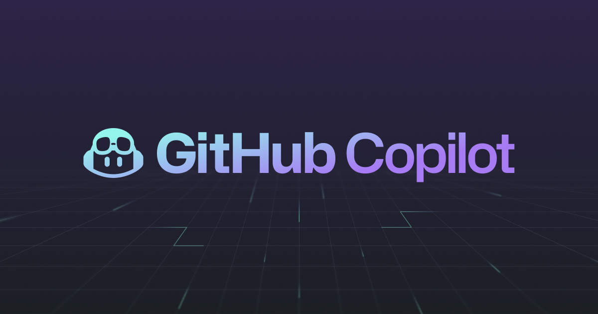

# 소프트웨어/IT/DevTools - AI 활용 디지털 프로덕트 및 사내 내재화 시장 조사

작성일: 2026-02-09

## Executive Summary

- 소프트웨어 개발 분야는 AI 도입이 가장 빠르고 광범위하게 일어난 산업으로, "AI Coding Assistant"가 개발자의 필수 도구(Commodity)로 자리 잡았다.
- 초기에는 코드 자동 완성(Autocomplete)에 그쳤으나, 현재는 전체 코드베이스를 이해하고 리팩토링, 테스트 작성, 문서화까지 수행하는 "AI Software Engineer" 수준으로 진화하고 있다.
- 기업들은 코드 보안과 IP 보호를 위해 범용 API(GitHub Copilot) 사용과 자체 모델(Open Source LLM Fine-tuning) 구축 사이에서 고민하고 있으며, **'Internal Developer Platform (IDP)'**에 AI를 내재화하는 추세가 강화되고 있다.

## Market Size & Outlook

### 1) AI in Software Development Market (Grand View Research)

- 2024년 시장 규모는 급성장 중이며, 개발자 생산성 도구 시장의 핵심 동력이 되고 있다.
- Gartner는 2028년까지 엔터프라이즈 소프트웨어 엔지니어의 75%가 AI 코딩 어시스턴트를 사용할 것으로 전망한다 (2023년 초 10% 미만).[^gartner-coding-ai]

### 전망(필수)

- **12-24개월:**
  - 에이전트형 코딩 도구 확산: 단순히 코드를 추천하는 것을 넘어, 터미널 명령을 실행하고 파일을 생성/수정하며 버그를 스스로 수정하는 "Devin" 같은 자율 에이전트가 상용화될 것이다.
  - 레거시 코드 현대화: 기업 내 방치된 레거시 코드(Java 8, COBOL 등)를 최신 스택으로 변환하는 AI 마이그레이션 프로젝트가 활발해질 것이다.
- **3-5년:**
  - No-Code/Low-Code와 AI의 결합: 자연어 프롬프트만으로 복잡한 엔터프라이즈 애플리케이션을 구축하는 시대가 도래하여, 전문 개발자는 아키텍처 설계와 AI 감독 역할로 이동할 것이다.
  - AI-Native DevOps: 배포, 모니터링, 장애 대응(Incident Response) 전 과정이 AI에 의해 자동화되는 AIOps가 표준이 될 것이다.

## Where AI Creates Value (Value Chain)

### Software Development Lifecycle (SDLC)

- **Coding & Implementation:** 코드 자동 완성, 함수 생성, 보일러플레이트 제거.
- **Testing & QA:** 유닛 테스트 자동 생성, 버그 탐지, 엣지 케이스 시나리오 생성.
- **Review & Refactoring:** 코드 리뷰 자동화, 성능 최적화 제안, 보안 취약점 스캔.
- **Documentation:** 코드 주석 및 API 문서 자동 생성, 변경 사항 요약.
- **Maintenance & Ops:** 로그 분석을 통한 장애 원인 파악, 인프라 코드(IaC) 생성.

## Implementation Patterns: In-House vs Big-Tech API

| Pattern | What It Looks Like | When It Wins | Risks/Costs | Evidence Signals |
|---|---|---|---|---|
| **Big-tech API (SaaS)** | GitHub Copilot, Cursor, JetBrains AI 활용 | 도입 즉시 생산성 향상, 유지보수 불필요, 최신 모델 사용 | 소스코드 유출 우려(Enterprise 버전으로 완화), 비용 | 전사적 Copilot 라이선스 구매 |
| **In-house model** | CodeLlama, StarCoder 등을 사내 서버에 구축 | 금융/방산 등 극도의 보안 요구, 사내 라이브러리/컨벤션 학습 필요 | 모델 서빙 비용, 지속적인 모델 업데이트 부담 | 자체 개발자 포털 내 AI 기능 통합 |
| **Hybrid** | 범용 코딩은 SaaS, 사내 지식(문서/코드)은 RAG로 연동 | 보안과 편의성의 조화, 사내 도메인 지식 활용 | RAG 파이프라인 구축 및 인덱싱 관리 필요 | Atlassian Rovo 등의 지식 검색 도구 도입 |

## Company 사례 (Evidence-Based)

### API/Vendor-based (Product)

- **GitHub:** **'GitHub Copilot'**은 시장 점유율 1위의 AI 코딩 도구로, OpenAI 모델을 기반으로 GitHub의 방대한 오픈소스 코드로 학습됨. 연구 결과 개발자의 코딩 속도를 **55% 향상**시키고, 사용자의 **88%**가 업무 몰입도 유지에 도움을 받았다고 응답함.[^github-copilot]

- **GitLab:** **'GitLab Duo'**는 AI 기능을 DevSecOps 플랫폼 전반에 통합. 소프트웨어 개발 수명 주기(SDLC) 전반에서 사이클 타임(Cycle time)을 **7배 단축**하는 효과를 입증하며 프라이버시 중심(Privacy-first) 접근을 강조.[^gitlab-duo]
- **Cursor (Anysphere):** VS Code 포크 기반의 AI 네이티브 에디터. 'Copilot'보다 더 깊이 있는 코드베이스 이해와 편집 기능을 제공하며 개발자들 사이에서 급부상.

### In-house model / Custom

- **Google:** 내부적으로 **'Goose'**라는 AI 모델을 활용하여 구글의 거대한 모노레포(Monorepo) 환경에서 개발자 생산성을 지원. 사내 특화된 프레임워크와 도구 사용법을 학습.[^google-goose]
- **Meta:** **'Code Llama'**를 자체 개발하여 내부적으로 활용 및 오픈소스로 공개. 사내 코드베이스에 맞춰 파인튜닝하여 사용.
- **Samsung:** 보안 우려로 사내에서 챗GPT 사용을 제한하고, 자체 개발한 코딩 어시스턴트(Samsung Gauss Code 등)를 임직원에게 제공하여 업무 효율화 추진.

## Risks, Constraints, and Governance

- **IP & Copyright:** AI가 생성한 코드의 저작권 문제 및 오픈소스 라이선스(GPL 등) 위반 가능성. "학습 데이터 오염" 리스크.
- **Security Vulnerabilities:** AI가 보안 취약점이 있는 코드를 생성하거나, 악의적인 패키지를 추천할 위험(Hallucination).
- **Shadow AI:** 개발자들이 회사의 승인 없이 개인적으로 외부 AI 도구에 회사 코드를 붙여넣는 보안 사고(Data Leakage).
- **Over-reliance:** 주니어 개발자들이 AI에 의존하여 코드의 작동 원리를 이해하지 못하고 복사-붙여넣기만 하는 역량 저하 우려.

## Outlook & Strategic Recommendations

- **"Enterprise Grade" 보안:** 기업용 AI 코딩 도구 도입 시, 데이터가 학습에 사용되지 않음을 보장하는 "Zero Data Retention" 정책 확인이 필수다.
- **사내 지식 자산화:** 단순히 코드를 짜는 것을 넘어, 사내 문서(Confluence, Notion)와 코드 저장소(GitHub/GitLab)를 연동한 RAG 시스템을 구축하여 "사내 지식 검색" 효율을 높여야 한다.
- **AI 리터러시 교육:** 개발자들이 AI가 생성한 코드를 비판적으로 검토(Code Review)하고 보안 취약점을 식별할 수 있도록 교육해야 한다.

## References

[^gartner-coding-ai]: Gartner. "Gartner Survey Reveals 75% of Enterprise Software Engineers Will Use AI Coding Assistants by 2028".
[^github-copilot]: GitHub Blog. "GitHub Copilot Enterprise is now generally available" (Feb 2024).
[^gitlab-duo]: GitLab. "GitLab Duo: AI-powered workflows".
[^google-goose]: Business Insider. "Google explicitly tells employees not to use code generated by chatbots" (leaked internal info context).
