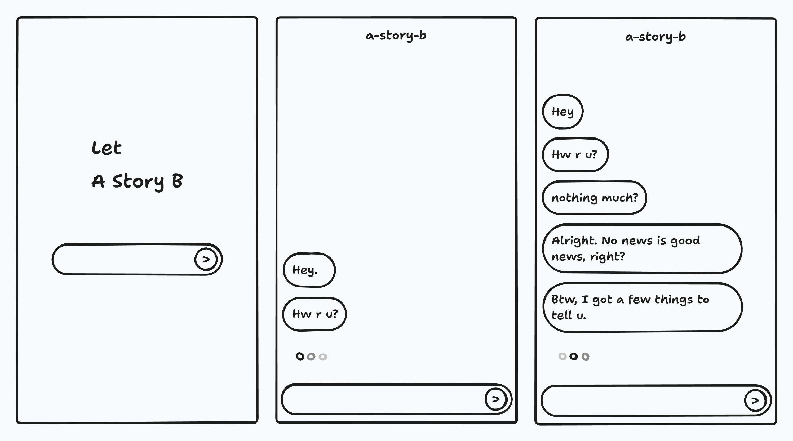
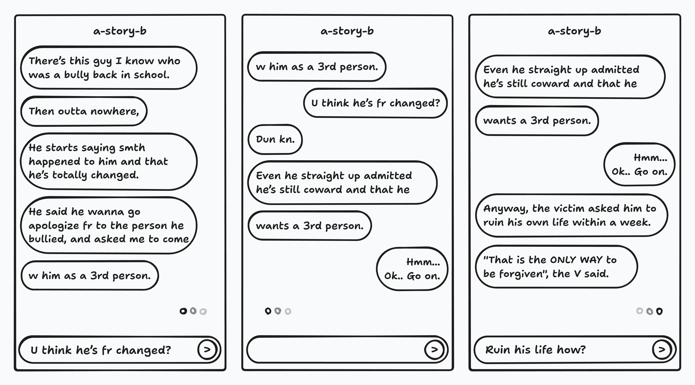

**STUDIO AMJ**

# Q1 '26 Work Plan Overview

Gwin Lim

---
<!-- header: TOC | Q1 '26 Work Plan Overview -->

## TOC

1. A-STORY-B
2. KIF > After Taste
3. Technical Support?

---
<!-- header: 1. A-STORY-B | Q1 '26 Work Plan Overview -->

# 1. A-STORY-B

- AI chat bot completes a story
- Dramatica theory + NCP

---

## Concepts

- Initiate casual conversation around a user-provided topic.
- Or suggest a predefined scenario designed to trigger a dilemma-style question.
- Guide the conversation so the Complete Story can be gradually filled in.

---

{:height="50%"}

---

{:height="50%"}

---

## Dramatica theory

- "story" set: undefinable
- "complete story" set:
  - A subset of story set.
  - Definable with Dramatica theory

---

## NCP (Narrative Context Protocol)

- Complete story's backbone
  - Structural (story form)
  - Representational (storytelling)
- Human-readable format
- Improved LLM consistancy

---

## Current Status #1: Set training data

### Problem #1: Lack of raw data for training

- [x] Solution #1: Crawling ([Dramatica Platform](https://platform.dramatica.com), NCP repository)
- [x] Solution #2: OCR-ing Dramatica book

### Problem #2: Data preprocessing

- Found issues in raw training data
  - referential ambiguity (broken data integrity)
  - hidden logical constratins
- [-] Solution #1: Building canonical entity model
- [ ] Solution #2: Analyzing Dramatica theory (patterns)
- [-] solution #3: Building graph traversal engine

---

## Current Status #2: `complete-story-evaluator`

- A package that contains a fine-tuned model, knowledge data, agents and APIs.
- It's **NOT** for chating.
- It evaluates the correctness of NCP-formatted messages generated from human natural-language messages, and vice versa.

### Problem #1: Serving localhost llm server

- [x] Solution #1: Finding compatiable combinations of Nvidia VGA driver's version, CUDA library version, vLLM version and base LLM.
- [ ] Solution #2: TRAIN!

---

# 2. KIF > After Taste

- 요청 드린 '컨텐츠 작성' 언제쯤 완료 될지?
  - [Slack DM Link](https://mjamj.slack.com/files/U09ETD9N3CY/F0AATM35ZQU/request-contents-preset.pdf)
  - [PDF direct download](./request-contents-preset.pdf)
- 더 필요한 기능 없을지?
- 추가 논의 필요?

---

## Meeting Result

- R&D는 계속 진행
- 늦어도 매 주 한번 씩은 시장 조사와 "상용 제품" 아이디어 공유
  - Story 생성
  - 완전히 다른 주제
    - 상용 프로그램을 위한, 이미지 생성 AI 응용 플러그인
    - 광고 프로덕션의 초고해상도 이미지 생성시 '지문' 레벨의 디테일이 조악하고 사실적이지 않는 문제 해결.